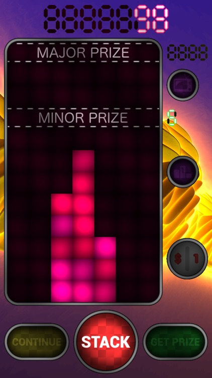
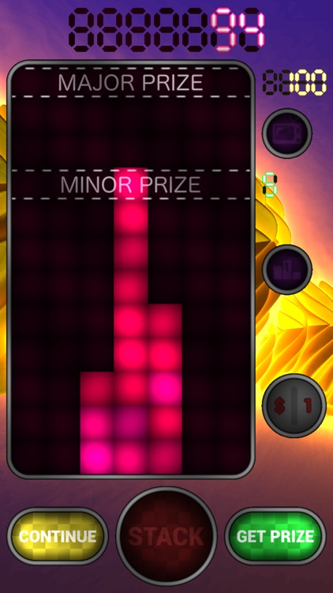
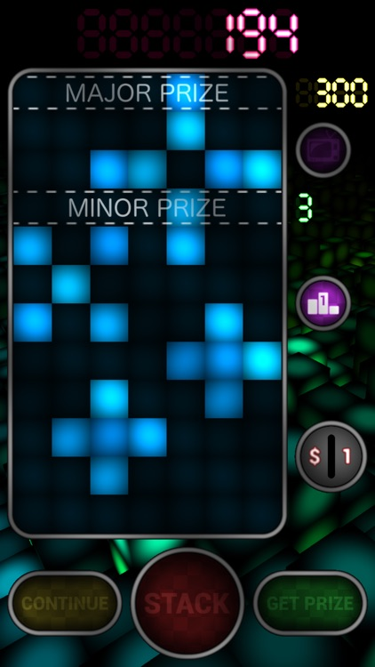
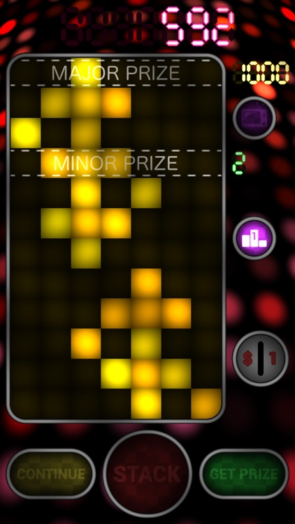
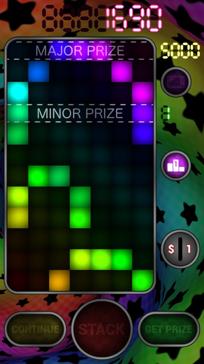

# Flamin Stack

## History

Flamin Stack is a game that I released on iOS in 2010, and which remained available on the App Store until mid-2018, when Apple suddenly decided that it was violating the "App Store Review Guidelines" (they claimed that that _"This app duplicates the content and functionality of other apps submitted by you or another developer to the App Store, which is considered a form of spam"_) - quite funny for an app that was available for 8 years, with 13 updates (hence, 13 reviews by Apple), 19888 players for the last version  and an average rating of 4.5 stars... But no, you cannot argue with Apple, they just do not care: it was game over for Flamin Stack.

First releases of Flamin Stack, back in 2010, were native iOS applications developed with Xcode. In 2016, I rewrote the game from scratch with Unity. The code shown here corresponds to the latest version, v2.1.7, that was made available on the App Store on November 6, 2017 (the old Xcode project can still be found [here](https://github.com/hknrx/Misc/tree/master/iOS/FlaminGames)).

The reason for this 2016 update was that I wanted to give Unity Ads a try. Also, having a bit of free time, I decided to re-implement Flamin Stack (its last update on the App Store was in February 2011!), and integrated video ads into the new version. But I didn't simply port the 2011 game to Unity, I also decided to opt for a totally new display architecture: instead of using classic sprites (i.e. textures) to render everything, I took advantage of my recent knowledge of shader tricks to experiment with procedural rendering in the game: almost everything is handled by fragment shaders - there are only a very few textures in the game (basically, they are for texts and icons), all graphic elements are generated on the GPU. This is certainly NOT something I would recommend for most games, and it is definitely a bad idea for platforms which the GPU is slow (e.g. old iOS devices), but it was fun and interesting to do. And not only it works very well on recent devices, it also allows to easily adapt to any screen resolution, and implement nice little features (e.g. Temporal Anti Aliasing: the game is rendered to 2 RenderTextures which the size is a fraction of the screen size, even frames being rendered normally while odd frames are shifted by 0.5 pixel, then the last 2 frames are mixed to display the game full screen - this makes things much easier for the GPU, and allowed me to also adapt to old devices: the scale factor of the RenderTextures is adapted depending on the frame rate, trading off quality for speed automatically). I then used the same architecture for "[Flamin Maze](https://github.com/hknrx/FlaminMaze)" a few months later.

## App Store description

> _Flamin Stack brings you a classic arcade game on your iPhone or iPad: stack blocks to the top and try filling your coin bucket! Simple and damn addicting!_
> 
> _Features:_
> - _5 different levels with increasing rewards, up to 9999 coins!_
> - _Stack 12 rows of blocks to claim the major prize and access the next level!_
> - _If you fail building your stack while at the last level, then you will return to the previous one, otherwise, you get a second chance: attempt to stop the timer precisely on 1000 to win 1000 coins and directly access the 4th level! If you stop between 995 and 1005, then you will get 100 coins and remain at your current level... but beware that you will be sent back to the 1st level if you fail to do so! Stay focused!_
> - _Compare your performances with others on the Game Center and try to unlock all achievements!_
> - _Possibility to switch back to the original Flamin Stack background animation (just tap the coin counter at the top of the screen to toggle the animation)._
> 
> _(2010 Nicolas Robert)_

## Screenshots

